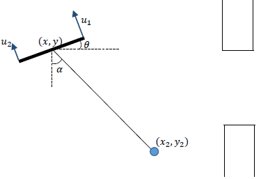
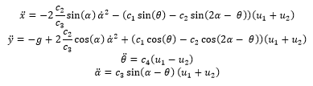
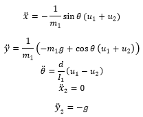
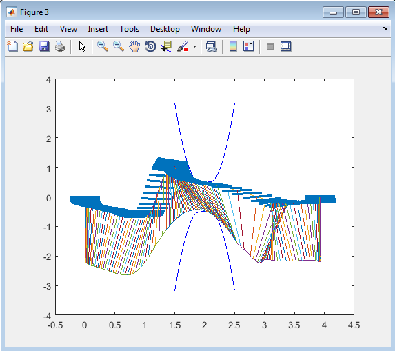
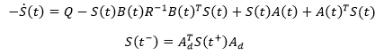
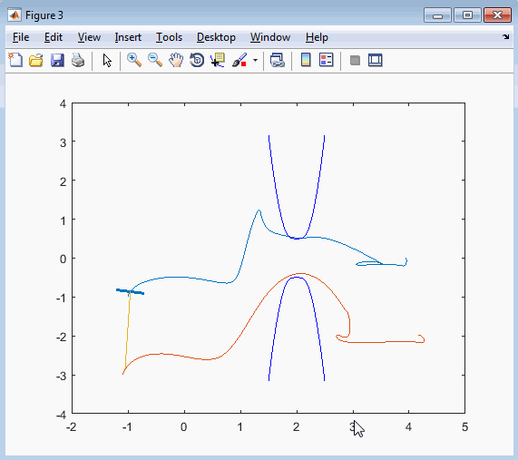

# hybrid-quad-cord-ball-control
Trajectory Optimization Control and Robustness of an Hybrid system, a 2D Quadcopter with a cord attached to a ball.

In this control problem we have a 2D Quadrotor with a load attached through a chord, which is a Hybrid System. The system is very similar to a 2D Quadrotor with a pendulum, with the difference that, when the inner tension forces inside the “pendulum” (chord in this case) are negative, the system will behave in a very different way. In fact, the load will be “detached” from the quadrotor and will behave as a free-falling ball, while the quadrotor will behave as a single and simple Quad. This behavior will take place as long as the distance from the load to the quad is less than *l*, the length of the chord. When the equality takes place, the instantaneous tension of the chord, will be modeled as a common impact between objects. If the collision is inelastic, the two bodies will behave as a quad with pendulum again, this is the first mode of the hybrid system. If the collision is elastic, the load will bounce, going back to the second mode (load “detached” of “flying”), but with a reset map applied.

We have the first mode of the system, when the chord is tensed or "AsOne":

The constants are related to the masses, inertias and lengths of the system.
 
The dynamics of the second mode of the system, when the load is detached or "Flight", are:
 

In the first figure, the height of the window has a height of a, with a<l, so we have now the control problem: Let’s make the quadrotor cross the window in order to take the system to the other side of the window. Note that the quadrotor must do a "trick" to make that, like throwing the ball there, because it can't cross the window directly.

After performing Hybrid Trajectory Optimization, specifically Direct Collocation, we get the following local optimal trajectory for a LQR cost function:

Optimization was done using drake library and SNOPT as solver. Drake version used was the same as the Repository from the PSETs of Underactuated Robotics 6.832x, a precompiled one for MATLAB. Some changes were made to the code, these are explained at the end of the pdf file.

But Trajectory Optimization gives a control signal in time, not feedback, open loop, which are in general not robust. In order to make it robust we perform an Hybrid TV-LQR, which is the same as TV-LQR but with a "Jump Riccati Equation" associated to the transitions between modes in the Hybrid System. We got an robust controller for the trajectory computed before. So, for the optimization we have:

We run the TVLQR controller and we get as performance:

Note that initial conditions here are *(x,y)=(-1,-1)* instead of *(0,0)*. We can see how the quad leans towards, applies force trying to reach their desired trajectory, and get it close to the original trajectory. The must importante part here is the state of the system at the change from the first mode to the second mode, because in the second mode the ball is uncontrolable (chord is not acting). So we can tune some values, we can even compute a penalization for the difference between the state and desired state at the time of the jump. We can put that computed penalization formula on the solver, for better performance, and we can also compute the region of attraction with Lyapunov functions, but for this demo this is enough.

Also some changes in original code from drake were made to allow, some of them are needed because are bugs an other is a minihack to the system. This changes must be made also in the last precompiled version from Drake v0.9.11 found at https://github.com/RobotLocomotion/drake/releases. This changes are explained in the pdf file.
